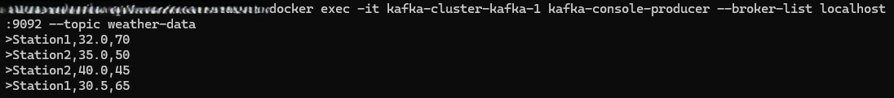
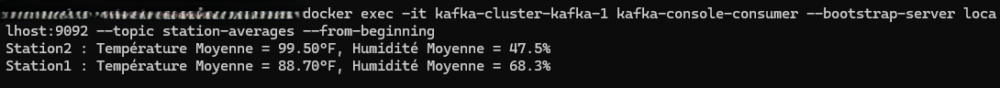
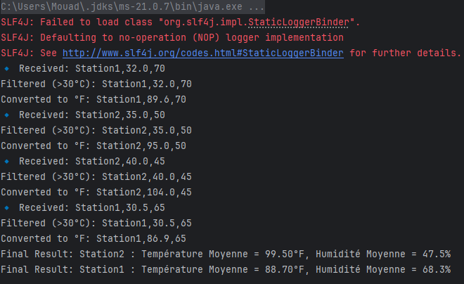

# 🌤️ WeatherStreamApp - Kafka Streams Météo

Une application Kafka Streams qui analyse des données météorologiques en temps réel.

---

## 🎯 Objectif

Lire les données de stations météo depuis Kafka, effectuer des transformations, calculer les moyennes de température (en °F) et d’humidité, puis publier les résultats agrégés dans un topic Kafka dédié.

---

## 🧱 Technologies utilisées

- Java 17+
- Apache Kafka
- Kafka Streams API
- Docker (pour Kafka)
- Maven

---

## ⚙️ Fonctionnement de l'application

### 🔹 1. Source des données

Les messages sont consommés du topic Kafka `weather-data` au format :

```
station,temperature,humidity
```

**Exemple :**
```
Station1,32.0,70
Station2,35.0,50
Station2,40.0,45
Station1,30.5,65
```

---

### 🔹 2. Étapes de traitement avec Kafka Streams

1. **Filtrage** : seules les températures > 30°C sont conservées.
2. **Conversion** : les températures sont converties en °F.
3. **Regroupement** : les relevés sont groupés par station.
4. **Agrégation** :
    - Température moyenne en °F
    - Humidité moyenne en %
5. **Publication** : les résultats sont envoyés dans le topic `station-averages`.

---

## 🧪 Exécution & Tests

### 🐳 Création des topics (via Docker)

```bash
# Topic d’entrée : weather-data
docker exec -it kafka-cluster-kafka-1 kafka-topics \
  --create --topic weather-data \
  --bootstrap-server localhost:9092 \
  --partitions 1 --replication-factor 1

# Topic de sortie : station-averages
docker exec -it kafka-cluster-kafka-1 kafka-topics \
  --create --topic station-averages \
  --bootstrap-server localhost:9092 \
  --partitions 1 --replication-factor 1
```

---

### 📤 Envoi de données dans le topic `weather-data`

```bash
docker exec -it kafka-cluster-kafka-1 kafka-console-producer \
  --broker-list localhost:9092 --topic weather-data
```

```
>Station1,32.0,70
>Station2,35.0,50
>Station2,40.0,45
>Station1,30.5,65
```

---

### 📥 Consommation des résultats depuis `station-averages`

```bash
docker exec -it kafka-cluster-kafka-1 kafka-console-consumer \
  --bootstrap-server localhost:9092 \
  --topic station-averages \
  --from-beginning
```

**Résultat attendu :**
```
Station2 : Température Moyenne = 99.50°F, Humidité Moyenne = 47.5%
Station1 : Température Moyenne = 88.70°F, Humidité Moyenne = 68.3%
```

---

## 🧩 Structure du projet

```
.
├── src/
│   └── main/
│       └── java/net/dach/WeatherStreamApp.java
├── README.md
└── pom.xml
```

---

## ✅ Lancement de l'application & Captures Terminal

### 1. Création des topics Kafka (`weather-data` & `station-averages`)


---

### 2. Envoi des données dans le topic `weather-data`



---

### 3. Consommation des résultats depuis `station-averages`



---

### 4. Lancement de l'application Kafka Streams




